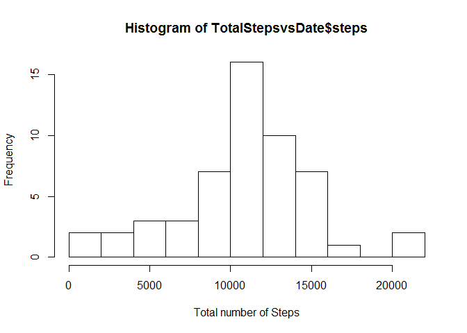
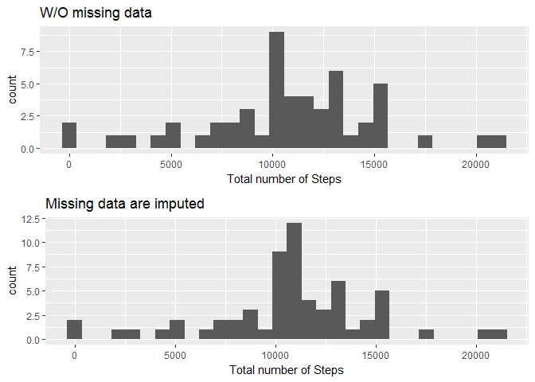

reading in the dataset

    library(ggplot2)
    library(gridExtra)
    Data<-read.csv("activity.csv")

Processing the data to be suitable for plotting and analysis - removing
rowes with NA

    TotalStepsvsDate<-aggregate(steps~date, data=Data[complete.cases(Data),], sum)

Histogram of the total number of steps taken each day

    hist(TotalStepsvsDate$steps, breaks=15,xlab ="Total number of Steps")

Calculations of mean and median ignoring rows with NA

    mean(TotalStepsvsDate$steps)

    ## [1] 10766.19

    median(TotalStepsvsDate$steps)

    ## [1] 10765

Preparing data showing number of steps averaged accross all days for
each of 5-min intervals ignoring rows with NA

    TotalStepsvsInterval<-aggregate(steps~interval, data=Data[complete.cases(Data),], mean)

The time interval containing maximum average number of steps is:

    which.max(TotalStepsvsInterval$steps)

    ## [1] 104

Here is the plot of the Average Number of Steps as a function of 5-min
time interval:

    plot(TotalStepsvsInterval$steps, type="l",xlab = "5-min Interval",ylab = "Average Number of Steps")

Calculation of total number of missing (NA) values:

    dim(Data)[[1]]-dim(Data[complete.cases(Data),])[[1]]

    ## [1] 2304

There are 2304 missing values. That is about 13% of total Data. Since
each days contains 288 5-min intervals, there are total 8 days of
missing data. One of the simplest ways to substitute the missing data is
by using mean value of corresponding 5-min interval calculated ommiting
rowes with missing values.

    NewData<-merge(Data,TotalStepsvsInterval,by = "interval",all = TRUE )
    bad<-is.na(NewData$steps.x)
    NewData$steps.x[bad]<-NewData$steps.y[bad]
    TotalStepsvsDateFull<-aggregate(steps.x~date, data=NewData, sum)

The values of mean and median

    mean(TotalStepsvsDateFull$steps.x)

    ## [1] 10766.19

    median(TotalStepsvsDateFull$steps.x)

    ## [1] 10766.19

of the modified data set are very close to what we calculated before

The histogram for the new new data set looks very similar as well

    require(gridExtra)
    plot1<-qplot(TotalStepsvsDate$steps, main ="W/O missing data", xlab ="Total number of Steps")
    plot2<-qplot(TotalStepsvsDateFull$steps.x, main = "Missing data are imputed",xlab ="Total number of Steps")
    grid.arrange(plot1, plot2, nrow=2)

    ## `stat_bin()` using `bins = 30`. Pick better value with `binwidth`.
    ## `stat_bin()` using `bins = 30`. Pick better value with `binwidth`.

Calculation of difference in activity pattern between weekdays and
weekends

    NewData$Weekday<-as.factor(ifelse(weekdays(as.Date(NewData$date)) %in% c("Monday", "Tuesday", "Wednesday", "Thursday", "Friday"), "weekday", "weekend"))
    day_activity<-aggregate(steps.x~interval+Weekday,data=NewData,mean)

Here is the plot of the Average Number of Steps as a function of 5-min
time interval for weekdays and weekends:

    qplot((seq_along(day_activity$steps.x)) %% 288,day_activity$steps.x,data=day_activity,geom="line", facets=Weekday~., xlab = "5-min Interval", ylab = "Average Number of Steps")

During the weekend an active period starts a little bit later in the
day. More
